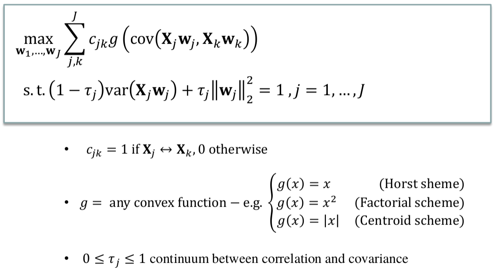
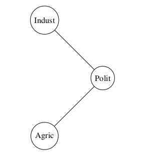

\newcommand{\ma}[1]{\mathbf{#1}}
\newcommand{\sign}{\ensuremath{\mathrm{sign}}}
\newcommand{\cov}{\ensuremath{\text{cov}}}
\newcommand{\X}{\mathbf{X}}
\newcommand{\A}{\mathbf{A}}
\newcommand{\Q}{\mathbf{Q}}
\newcommand{\M}{\mathbf{M}}
\newcommand{\mbc}{\mathbf{c}}
\newcommand{\I}{\mathbf{I}}
\newcommand{\mbP}{\mathbf{P}}
\newcommand{\mba}{\mathbf{a}}
\newcommand{\z}{\mathbf{z}}
\newcommand{\w}{\mathbf{w}}
\newcommand{\y}{\mathbf{y}}
\newcommand{\mbb}{\mathbf{b}}
\newcommand{\Xu}{\underline{\mathbf{X}}}
\newcommand{\Pu}{\underline{\mathbf{P}}}
\newcommand{\x}{\mathbf{x}}
\newcommand{\K}{\mathbf{K}}
\newcommand{\mcH}{\mathcal{H}}
\newcommand{\bsx}{\boldsymbol{x}}
\newcommand{\bsxi}{\boldsymbol{\xi}}
\newcommand{\bsa}{\boldsymbol{\alpha}}
\bibliographystyle{apalike}
\bibliography{biblio}


```{r setup, include=FALSE}
require(knitr)
knitr::opts_chunk$set(echo = TRUE, message = FALSE, warning = FALSE, 
                      comment = NA, prompt = TRUE, tidy = FALSE, 
                      fig.width = 7, fig.height = 7, fig_caption = TRUE,
                      cache=FALSE)
Sys.setlocale("LC_TIME", "C")
```

```{r echo=FALSE}
if(!(require(printr))) {
  install.packages(
    'printr',
    type = 'source',
    repos = c('http://yihui.name/xran', 'http://cran.rstudio.com')
  )
}
if(!(require(ggplot2))) install.packages("ggplot2", dep=TRUE)
```

# Introduction

This is a document intended to help understand, explain and practice the RGCCA method. It has been almost entirely extracted from the package vignette [@Tennenhaus2013] and from an applications paper [@Garali2017]. The merits are attributable to them. The errors are mine.

## The RGCCA method

The RGCCA and SGCCA methods developed by Tennenhaus et alt. (2011) implement a flexible multiblock analysis which can be seen as a generalization of an extense group of related multiblock but also multi-group methods.

The term "generalized" in the acronym of RGCCA embraces at least three notions. 
- The first one relates to the generalization of two-block methods - including Canonical Correlation Analysis [@Hotelling1936]  Interbattery Factor Analysis [@Tucker1958] and Redundancy Analysis [@Wollenberg1977] - to three or more sets of variables. 
- The second one relates to the ability of taking into account some hypotheses on between-block connections: the user decides which blocks are connected and which ones are not. - The third one relies on the choices of the shrinkage parameters allowing to capture both correlation or covariance-based criteria.

The method works by finding several sets of block components which summarize the relevant information between and within the blocks. This components may be optimal in a variety of forms as defined by a series of parameters. In the case of RGCCA there are three parameters


- The __design matrix__, $\mathbf{C}$, is a symmetric  $J \times J$ matrix of nonnegative elements describing the network of connections between blocks that the user wants to take into account. Usually, $c_{jk}=1$ for two connected blocks and 0 otherwise.
- The __scheme function__, $g$, which describes the transformation applied to the covariance function between the blocks. $g$ is a continuous convex function and allows to consider different optimization criteria. 
- The __shrinkage function__, $\tau$, ranging from $0$ to $1$ and interpolate smoothly between __maximizing the covariance__ and __maximizing the correlation__
    -  Setting the $\tau_j$ to 0 will force the block components to unit variance ($\mathrm{var}(\X_j\ma a_j = 1)$), in which case the covariance criterion boils down to the correlation. The correlation criterion is better in explaining the correlated structure across datasets, thus discarding the variance within each individual dataset.  
    - Setting $\tau_j$  to 1 will normalize the block weight vectors ($\ma a_j^\top\ma a_j = 1$ ), which applies the covariance criterion. 
    - A value between $0$ and $1$ will lead to a compromise between the two first options.

```{r RCGGAmodel, fig.cap="RGCCA model and parameter", echo=FALSE}

```


## A strategy for biomarker identification based on RGCCA

In a recent paper Garali (2017) suggests a strategy for multimodal data integration based on the application of SCGGA. We will attempt to illustrate (to see) this strategy.

Many papers of this group are based on a dataset that is not  public yet, the SCA dataset. THis makes it more difficult to reproduce their examples so what I will do will be to rely on the RGCCA package vignette and try to find out if the suggested strategy can be visuaklized in it.

# Vignette's analysis (1) RGCCA for the Russett dataset.

In this section, we propose to reproduce some of the results presented in [@Tenenhaus2011] for the Russett data. The Russett dataset is available within the RGCCA package. The Russett data set [@Russett1964] are studied in [@Gifi1990]. Russett collected this data to study relationships between Agricultural Inequality, Industrial Development and Political Instability.

```{r}
library(RGCCA)
data(Russett)
head(Russett)
```

## Constructing the multiblock dataset

The first step of the analysis is to define the blocks. Three blocks of variables have been defined for 47 countries. The variables that compose each block have been defined according to the nature of the variables.

- The first block $\X_1$ = [GINI, FARM, RENT] is related to "Agricultural Inequality":
    + GINI = Inequality of land distribution,
    + FARM = \% farmers that own half of the land (> 50),
    + RENT = \% farmers that rent all their land.

- The second block $\X_2$ = [GNPR, LABO] describes "Industrial Development":
    + GNPR = Gross national product per capita ($1955),
    + LABO = % of labor force employed in agriculture.

- The third one $\X_3$ = [INST, ECKS, DEAT] measures "Political Instability":
    + INST = Instability of executive (45-61),
    + ECKS = Number of violent internal war incidents (46-61),
    + DEAT = Number of people killed as a result of civic group violence (50-62).
    + An additional variable DEMO describes the political regime: stable democracy, unstable democracy or dictatorship. The dummy variable "unstable democracy" has been left out because of redundancy.

The different blocks of variables $\X_1, \ldots, \X_J$ are arranged in the list format.

```{r}
X_agric = as.matrix(Russett[,c("gini","farm","rent")])
X_ind = as.matrix(Russett[,c("gnpr","labo")])
X_polit = as.matrix(Russett[ , c("inst", "ecks",  "death",
                                 "demostab", "dictator")])
A = list(X_agric, X_ind, X_polit)
sapply(A, head)
```

## Preprocessing 

In order to ensure comparability between variables standardization is applied (zero mean and unit variance).

```{r}
A = lapply(A, function(x) scale2(x, bias = TRUE))
```

We note that to make blocks comparable, a possible strategy is to standardize the variables and then to divide each block by the square root of its number of variables [@Westerhuis1998]. This two-step procedure leads to $\mathrm{tr}(\ma X_j^t \ma X_j )=n$  for each block (i.e. the sum of the eigenvalues of the covariance matrix of $\ma X_j$ is equal to $1$ whatever the block). Such a preprocessing is reached by setting the `scale` argument to `TRUE` (default value) in the `rgcca()` and `sgcca()` functions.

## Definition of the design matrix $\mathbf{C}$.

From Russett's hypotheses, it is difficult for a country to escape dictatorship when its agricultural inequality is above-average and its industrial development below-average. These hypotheses on the relationships between blocks are depicted in Figure \ref{fig:C}.

\begin{figure}[!!!h]
\centering
\begin{tikzpicture}
\tikzstyle{every node}=[draw,shape=circle,auto,node distance=3.5cm];
\node (Polit) {Polit};
\node (Agric) [below left of=Polit] {Agric};
\node (Indust) [above left of=Polit] {Indust};
\draw (Agric) -- (Polit)
(Indust) -- (Polit);
\end{tikzpicture}
\caption{between-block connection.}
\label{fig:C}
\end{figure}

```{r figC, fig.cap="RGCCA model and parameter", echo=FALSE}

```

and encoded through the design matrix $\mathbf{C}$; usually $c_{jk} = 1$ for two connected blocks and $0$ otherwise. Therefore, we have decided to connect Agricultural Inequality to Political Instability ($c_{13} = 1$), Industrial Development to Political Instability ($c_{23} = 1$) and to not connect Agricultural Inequality to Industrial Development ($c_{12} = 0$). The resulting design matrix $\ma C$ is:

```{r}
#Define the design matrix C.
C = matrix(c(0, 0, 1,
0, 0, 1,
1, 1, 0), 3, 3)

cat("Matrix C\n")
show(C)
```

## Determining parameters and scheme function

RGCCA using the pre-defined design matrix $\ma C$, the factorial scheme ($g(x) = x^2$) and mode B for all blocks (full correlation criterion) is obtained by specifying appropriately the `C`, `scheme` and `tau` arguments of the `rgcca()` function. The `verbose` argument (default value = `TRUE`) indicates that the progress will be reported while computing and that a plot representing the convergence of the algorithm will be returned.


```{r}
rgcca_B_factorial = rgcca(A, C, tau = rep(0, 3), scheme = "factorial",
scale = FALSE, verbose = TRUE)
```

The weight vectors, solution of the optimization problem (\ref{optim_RGCCA}) are obtained as:

```{r}
rgcca_B_factorial$a # weight vectors
```

and correspond exactly to the weight vectors reported in [@Tenenhaus2011, see Figure 4]. The block-components are also avalaible as output of `rgcca`. The first components of each block are given by:

```{r}
Y = rgcca_B_factorial$Y
lapply(Y, head)
```

## Determination of the number of block components

Cross-validation is usually used to determine the number of block components to retain. Depend on the context (supervised or unsupervised), two types of cross-validation can be considered in the framework of RGCCA/SGCCA:

- When the analysis is oriented toward the prediction of a specific phenotype, then the number of components per block can be selected based on the cross-validated prediction accuracy.
- When no external information is available, then the number of components per block can be estimated as follows. For each block j, some percent of the elements of $\X_j$ is removed at random from the data matrix. The RGCCA block components are estimated from this partially observed data set. For each block, the missing values are imputed using the reconstruction formula. The number of components that results in the lowest sum of squared errors of the missing values is retained.

Besides, the average variance explained (AVE) by a block component $y_j$ can also inform on the number of component to retain. 

- The AVE of block $\ma X_j$, denoted by AVE($\ma X_j$), is defined as:

\begin{equation}
\mathrm{AVE}(\ma X_j)=  1/p_j \sum_{h=1}^{p_j} cor^2( \ma x_{jh},\ma y_j)
\end{equation}

AVE($\ma X_j$) varies between 0 and 1 and reflects the proportion of variance captured by $\ma y_j$.

- For all blocks:

\begin{equation}
\displaystyle \mathrm{AVE(outer model)} = \left( 1/\sum_j p_j \right) \sum_j p_j \mathrm{AVE}(\ma X_j)
\end{equation}

- For the inner model:

\begin{equation}
\displaystyle \mathrm{AVE(inner model)} = \left( 1/\sum_{j<k} c_{jk} \right) \sum_{j<k} c_{jk} \mathrm{cor}^2(\ma y_j , \ma y_k)
\end{equation}

These indicators of model quality can be obtained as follows:

```{r}
rgcca_B_factorial$AVE
```

and corresponds exactly to the results reported in [@Tenenhaus2011, see last column of Table 7].

### Optimal shrinkage parameters

An "optimal" shrinkage parameter $\tau_j$ can be obtained, for each block $j$,  from the Schafer and Strimmer analytical formula [@Schafer2005] by using the `tau` argument of the rgcca funtion:

```{r}
rgcca_optimal_factorial = rgcca(A, C, tau = "optimal", scheme = "factorial",
scale = FALSE, verbose = FALSE)
```

The optimal shrinkage parameters are given by:

```{r}
rgcca_optimal_factorial$tau
```

This automatic estimation of the shrinkage parameters allows one to come closer to the correlation criterion, even in the case of high multicollinearity or when the number of individuals is smaller than the number of variables.

## Visualization of the results

At last, as a component-based method, RGCCA provides the users with graphical representations, including factor plot, correlation circle. This graphical displays allows visualizing the sources of variability within blocks, the relationships between variables within and between blocks and the amount of correlation between blocks. The graphical display of the countries obtained by crossing $\ma X_1 \ma a_1$ = Agricultural Inequality and $\ma X_2 \ma a_2$ = Industrial Development and marked with their political regime in 1960 is shown in below.

```{r, eval=TRUE, fig.align='center', fig.cap = 'graphical display of the countries obtained by crossing y1 and y2 and labeled according to their political regime'}
df = data.frame(political_regime =
factor(apply(Russett[, 9:11], 1, which.max),
labels = c("demostab", "demoinst", "dictator")),
comp1 = rgcca_B_factorial$Y[[1]][, 1],
comp2 = rgcca_B_factorial$Y[[2]][, 1])

p <- ggplot(df, aes(comp1, comp2)) +
geom_vline(xintercept = 0) +
geom_hline(yintercept = 0) +
ggtitle("Factor plot (Russett data)") +
geom_text(aes(colour = political_regime, label= rownames(df)),
vjust=0,nudge_y = 0.03,size = 3 )+
theme(legend.position="bottom", legend.box = "horizontal",
legend.title = element_blank())

p
```

Countries aggregate together when they share similarities. It may be noted that the lower left quadrant concentrates on dictatorships. It is difficult for a country to escape dictatorship when its industrial development is below-average and its agricultural inequality is above average. It is worth pointing out that some unstable democracies located in this quadrant (or close to it) became dictatorships for a period of time after 1960: Greece (1967-1974), Brazil (1964-1985), Chili (1973-1990), and Argentina (1966-1973).

Moreover, _**in the framework of consensus PCA and Hierarchical PCA**_, a superblock defined as the concatenation of all the blocks is also used and global components can be derived. The space spanned by the global components is viewed as a compromise space that integrated all the modalities and facilitates the visualization of the results and their interpretation.

Here, $2$ components per block are specified using the `ncomp = rep(2, 4)` argument (default value `ncomp = rep(1, length(A))`, which gives one component per block).

```{r}

X_agric =as.matrix(Russett[,c("gini","farm","rent")])
X_ind = as.matrix(Russett[,c("gnpr","labo")])
X_polit = as.matrix(Russett[ , c("inst", "ecks",  "death",
"demostab", "demoinst", "dictator")])
A = list(X_agric = X_agric, X_ind = X_ind, X_polit = X_polit,
Superblock = cbind(X_agric, X_ind, X_polit)
)
#Define the design matrix (output = C)
C = matrix(c(0, 0, 0, 1,
0, 0, 0, 1,
0, 0, 0, 1,
1, 1, 1, 0), 4, 4)

rgcca.hpca = rgcca(A, C, tau = c(1, 1, 1, 0), verbose = FALSE,
ncomp = rep(2, 4),
#flexible design of the scheme function
scheme = function(x) x^4,
scale = TRUE)
```

For HPCA, the countries can be represented in the space spanned by the two first global components.

```{r, fig.align='center', fig.cap = 'graphical display of the countries obtained by crossing the two first compoent of the superblock and labeled according to their political regime'}

df1 = data.frame(political_regime =
factor(apply(Russett[, 9:11], 1, which.max),
labels = c("demostab", "demoinst", "dictator")),
rgcca.hpca$Y[[4]]
)

p1 <- ggplot(df1, aes(comp1, comp2)) +
geom_vline(xintercept = 0) +
geom_hline(yintercept = 0) +
ggtitle("Factor plot (Russett data) - Common Space") +
geom_text(aes(colour = political_regime, label= rownames(df1)),
vjust=0,nudge_y = 0.03,size = 3)+
theme(legend.position="bottom", legend.box = "horizontal",
legend.title = element_blank())

p1
```

Despite some overlap, the first global component exhibits a separation/continuum among regimes. 

Moreover, the correlation circle plot highlights the contribution of each variable to the contruction of the global components. This figure shows the original variables projected on the compromise space.

```{r, eval=TRUE, fig.align='center', fig.pos="!!h", TRUE, fig.cap = 'correlation circle plot - two first components of the superblock. Variables are colored according to their block membership'}
df2 = data.frame(comp1 = cor(Russett, rgcca.hpca$Y[[4]])[, 1],
comp2 = cor(Russett, rgcca.hpca$Y[[4]])[, 2],
BLOCK = rep(c("X1", "X2", "X3"), sapply(A[1:3], NCOL)))

# Circle
circleFun <- function(center = c(-1,1),diameter = 1, npoints = 100){
r = diameter / 2
tt <- seq(0,2*pi,length.out = npoints)
xx <- center[1] + r * cos(tt)
yy <- center[2] + r * sin(tt)
return(data.frame(x = xx, y = yy))
}

circle <- circleFun(c(0,0),2,npoints = 100)

p2 <-ggplot(df2, aes(comp1, comp2), colour = BLOCK) +
geom_path(aes(x,y), data=circle) +
geom_vline(xintercept = 0) +
geom_hline(yintercept = 0) +
ggtitle("Correlation Circle (Russett data) - Common Space") +
geom_text(aes(colour = BLOCK, label= rownames(df2)),
vjust=0,nudge_y = 0.03,size = 3)+
theme(legend.position="bottom", legend.box = "horizontal",
legend.title = element_blank())

p2
```

A variable that is highly expressed for a category of individuals is projected with a high weight (far from the origin) in the direction of that category.

## Assessment of the reliability of parameter estimates

It is possible to use a bootstrap resampling method  to assess the reliability of parameter estimates obtained using RGCCA. 

B bootstrap samples of the same size as the original data is repeatedly sampled with replacement from the original data. RGCCA is then applied to each bootstrap sample to obtain the R/SGCCA estimates. 

For RGCCA, we calculate the mean and variance of the estimates across the bootstrap samples, from which we derived, bootstrap confidence intervals, t-ratio and p-value (under the assumption that the parameter estimates exhibited asymptotic normality) to indicate how reliably parameters were estimated. 

Since several p-values are constructed simultaneously, Bonferroni or FDR corrections can be applied for controlling the Family-Wise Error Rate or the False Discovery Rate, respectively. This function is not yet available in the current version of the RGCCA package and is available upon request.

# Discussion and conclusions

R/SGCCA stands as a unique, general and original way for analyzing high-dimensional multiblock data sets. It allows the selection of a few meaningful variables that underline the between-block connections encoded by the design matrix C`. This design matrix is highly modular to fit any prior knowledge the user has on the links between blocks. The variable selection property results in models more easily interpretable than a model based on all the variables. Being able to select variables means that one can also study the stability of the variable selection process and possibly deduce patterns in the way the variables are selected under sampling. Moreover, the selection of a few meaningful variables from longitudinal studies will enable their combination into a composite score. Such a composite score can be used as a proxy for disease severity and acts as a basis for future therapeutic studies. Indeed, composite scores are likely to provide both a better reflection of the disease process pathology and a larger effect size than any biomarker alone. This is crucial for the assessment of experimental treatments in many neurodegenerative conditions, and especially in rare diseases like SCA where patient’s recruitment is challenging. Finally, we showed that having blocks of heterogeneous sizes and nature is taken into account routinely by SGCCA. Likewise, the application of SGCCA on our SCA data set pinpoints at a possible role of some lipid species in the pathophysiology of SCA7 compared with other SCA, which merits further metabolic explorations.

Of note, RGCCA can also be applied to longitudinal data using the multiway formalism, which accounts for multiple measurements (either in time or in type of acquisition) of a given feature [62]. Multigroup structure (i.e. same sets of variables observed on different groups of individuals) can also be tackled with RGCCA: the aim is to uncover similar relationships between variables across the various groups [63]. Beyond the example data set used in this study, this framework proves equally efficient to manage and interpret a large variety of biological data types, typically information produced by next-generation sequencing approaches (e.g. DNA-seq, RNA-seq, Methyl-seq, etc.) that are increasingly used to further investigate normal or pathological biological processes.

# References